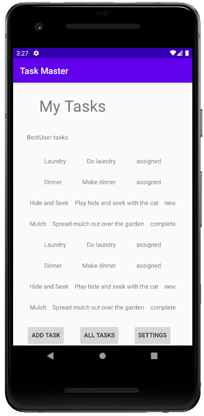

# Task Master

An Android app for tracking tasks!

## Changelog

  - 10/19/20
    - initialized project
    - main tasks page added
    - add task page added
    - task list page added
  - 10/20/20
    - created task details page
    - created settings page
    - added task buttons with intents to task details
    - task list title dynamic to username in settings
   - 10/21/20
    - task class created
    - set up recycler view for task list
    - made task list clickable to view details
  - 10/22/20
    - added Room dependencies and linked Task as an Entity
    - edited task list to refer to database
    - replaced hard coded task inserts with reference to add form

## Main Page

## Detail View

