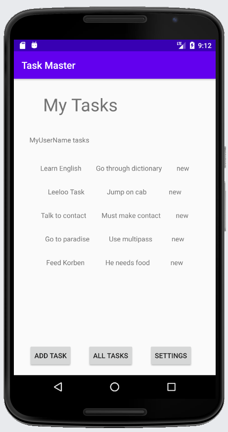

# Task Master

An Android app for tracking tasks!

## Changelog

  - 10/19/20
    - initialized project
    - main tasks page added
    - add task page added
    - task list page added
  - 10/20/20
    - created task details page
    - created settings page
    - added task buttons with intents to task details
    - task list title dynamic to username in settings
   - 10/21/20
    - task class created
    - set up recycler view for task list
    - made task list clickable to view details
  - 10/22/20
    - added Room dependencies and linked Task as an Entity
    - edited task list to refer to database
    - replaced hard coded task inserts with reference to add form
    - adding tests for task and username changes
  - 10/26/20
    - adding tests for task views and main user paths
    - updated screenshots
  - 10/27/20
    - connected to DynamoDB using Amplify
    - converted task add to save to DynamoDB instead of Room
    - main page task list now updated from DynamoDB
  - 10/28/20
    - added subscription and handler to keep task list up to date with cloud
    - created state and team models with relations to the task model
    - replaced submitted popup with toast on add task form
    - added hard coded radio button team selection to add task form
    - updated task save to match relations on DynamoDB
    - removed connection to local Room storage
    - task list now displays tasks of user's team
  - 11/02/20
    - added Cognito user authentication plugin
    - created activities for signup, user confirmation, and login

## Main Page

## Detail View

## Add Task Form

## Settings Page

